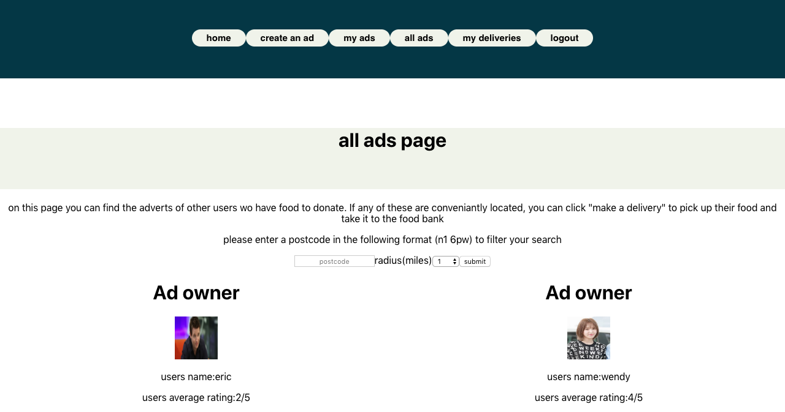

# README
No Waste-

This application is built with React JS and Ruby on Rails. It is a website which helps reduce food waste. Users may have food they would like to donate, but may not have the means to transport the food to where it needs to go. We allow users to create an advert saying that they have certain food at a certain postcode. Other users can than filter through adverts by location and help to pick up and transport the food to a food bank.

To start this backend please run the following commands

-rails db:create
-rails db:migrate
-rails db:seed
-rails s (on port 3000), alternatively enter your chosen port number in the front end repo(link below) at file path "/src/serverURL/serverURL.js"

then please run the frontend from the following repo:
https://github.com/hs21hs/mod5_frontend

